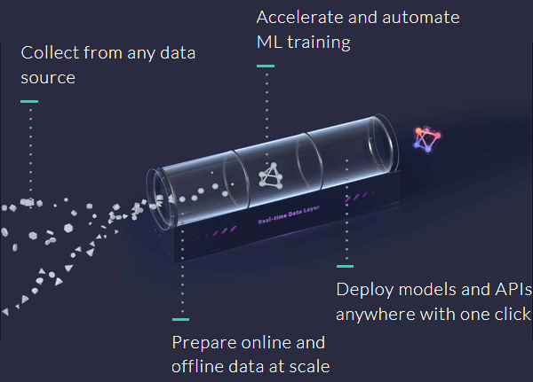

# Welcome to the Iguazio Data Science Platform

An initial introduction to the Iguazio Data Science Platform and the platform tutorials

- [Platform Overview](#platform-overview)
- [Data Science Workflow](#data-science-workflow)
- [The Tutorial Notebooks](#the-tutorial-notebooks)
- [End-to-End Use-Case Applications](#end-to-end-use-case-applications)
- [Additional Platform Resources](#platform-resources)
- [Miscellaneous](#misc)

<a id="platform-overview"></a>
## Platform Overview

The Iguazio Data Science Platform (**"the platform"**) is a fully integrated and secure data science platform as a service (PaaS), which simplifies development, accelerates performance, facilitates collaboration, and addresses operational challenges.
The platform incorporates the following components:

- A data science workbench that includes Jupyter Notebook, integrated analytics engines, and Python packages
- Model management with experiments tracking and automated pipeline capabilities
- Managed data and machine-learning (ML) services over a scalable Kubernetes cluster
- A real-time serverless functions framework &mdash; Nuclio
- An extremely fast and secure data layer that supports SQL, NoSQL, time-series databases, files (simple objects), and streaming
- Integration with third-party data sources such as Amazon S3, HDFS, SQL databases, and streaming or messaging protocols
- Real-time dashboards based on Grafana

<br><br>

<a id="data-science-workflow"></a>
## Data Science Workflow

The platform provides a complete data science workflow in a single ready-to-use platform that includes all the required building blocks for creating data science applications from research to production:

- Collect, explore, and label data from various real-time or offline sources
- Run ML training and validation at scale over multiple CPUs and GPUs
- Deploy models and applications into production with serverless functions
- Log, monitor, and visualize all your data and services



<a id="the-tutorial-notebooks"></a>
## The Tutorial Notebooks

The home directory of the platform's running-user directory (**/User/&lt;running user&gt;**) contains pre-deployed tutorial Jupyter notebooks with code samples and documentation to assist you in your development &mdash; including a **demos** directory with end-to-end use-case applications (see the next section) and a **getting-started** directory with examples for performing basic tasks.

> **Note:**
> - To view and run the tutorials from the platform, you first need to create a Jupyter Notebook service.
> - The **welcome.ipynb** notebook and main **README.md** file provide the same introduction in different formats.

<a id="end-to-end-use-case-applications"></a>
## End-to-End Use-Case Applications

Iguazio provides full end-to-end use-case applications (demos) that demonstrate how to use the platform and related tools to address data science requirements for different industries and implementations.

<a id="predeployed-demos"></a>
### Pre-Deployed Platform Demos

The platform comes pre-deployed with the following end-to-end use-case demos, which are available in the **demos** tutorial-notebooks directory.
For more details, see [**demos/README.md**](demos/README.md) (available also as a [notebook](demos/README.ipynb)):

- <a id="nlp-demo"></a>[**Natural language processing (NLP)**](demos/nlp/nlp-example.ipynb) &mdash; processes natural-language textual data and generates a Nuclio serverless function that translates any given text string to another (configurable) language.
- <a id="stream-enrich-demo"></a>[**Stream enrichment**](demos/stream-enrich/stream-enrich.ipynb) &mdash; implements a typical stream-based data-engineering pipeline, including real-time data enrichment using a NoSQL table.
- <a id="stocks-demo"></a>[**Smart stock trading**](demos/stocks/01-gen-demo-data.ipynb) &mdash; reads stock-exchange data from an internet service into a time-series database (TSDB) and performs real-time market-sentiment analysis on specific stocks; the data is saved to a platform NoSQL table for generating reports and analyzing and visualizing the data on a Grafana dashboard.
- <a id="location-based-recommendations-demo"></a>[**Location-based recommendations**](demos/location-based-recommendations/01-generate-stores-and-customers.ipynb) &mdash; generates real-time product purchase recommendations for users of a credit-card company based on the users' physical location.
- <a id="real-time-user-segmentation-demo"></a>[**Real-time user segmentation**](demos/slots-stream/real-time-user-segmentation.ipynb) &mdash; builds a stream-event processor on a sliding time window for tagging and untagging users based on programmatic rules of user behavior.

<a id="additional-demos"></a>
### Additional Demos

You can download additional demos from GitHub &mdash; for example:

- <a id="xgboost-demo"></a>[**XGBoost classification**](https://github.com/mlrun/demo-xgb-project) &mdash; uses XGBoost to perform binary classification on the popular Iris ML data set, and runs parallel model training with hyperparameters.
- <a id="image-classification-demo"></a>[**Image classification**](https://github.com/mlrun/demo-image-classification) &mdash; builds and trains an ML model that identifies (recognizes) and classifies (labels) images by using Keras, TensorFlow, and Horovod.

For information on the available demos, see the [demo listing](https://github.com/mlrun/mlrun/blob/master/docs/demos.md).<br>
For each downloaded demo, start out by reading its **README.md** file.

The following example code downloads the [mlrun/demo-xgb-project](https://github.com/mlrun/demo-xgb-project) XGBoost-classification demo:


```sh
%%sh
# Download the MLRun XGBoost classificaiton demo
cd /User/demos/
git clone git://github.com/mlrun/demo-xgb-project.git
```

<a id="platform-resources"></a>
## Additional Platform Resources

- [Introduction video](https://www.youtube.com/watch?v=8OmAN4wd7To)
- [In-depth platform overview](platform-overview.ipynb) with a break down of the steps for developing a full data science workflow from development to production
- [Platform components, services, and development ecosystem introduction](https://www.iguazio.com/docs/intro/latest-release/ecosystem/)
- [References](https://iguazio.com/docs/reference/latest-release/)
- [nuclio-jupyter SDK](https://github.com/nuclio/nuclio-jupyter/blob/master/README.md) for creating and deploying Nuclio functions with Python and Jupyter Notebook
- [Iguazio sample data-set](http://iguazio-sample-data.s3.amazonaws.com/) public Amazon S3 bucket

<a id="misc"></a>
## Miscellaneous

<a id="creating-virtual-environments-in-jupyter-notebook"></a>
### Creating Virtual Environments in Jupyter Notebook

A virtual environment is a named, isolated, working copy of Python that maintains its own files, directories, and paths so that you can work with specific versions of libraries or Python itself without affecting other Python projects.
Virtual environments make it easy to cleanly separate projects and avoid problems with different dependencies and version requirements across components.
See the [virutal-env](getting-started/virutal-env.ipynb) tutorial notebook for step-by-step instructions for using conda to create your own Python virtual environments, which will appear as custom kernels in Jupyter Notebook.

<a id="update-notebooks"></a>
### Updating the Tutorial Notebooks to the Latest Version

You can use the provided **igz-tutorials-get.sh** script to update the tutorial notebooks to the latest stable version available on [GitHub](https://github.com/v3io/tutorials/).
For details, see the [**update-tutorials.ipynb**](update-tutorials.ipynb) notebook.

<a id="v3io-dir"></a>
### The v3io Directory

The **v3io** directory that you see in the file browser of the Jupyter UI displays the contents of the `v3io` data mount for browsing the platform data containers.
For information about the predefined data containers and data mounts and how to reference data in these containers, see [Platform Data Containers](getting-started/getting-started-basic.ipynb/#platform-data-containers).

<a id="support"></a>
### Support

The Iguazio [support team](mailto:support@iguazio.com) will be happy to assist with any questions.
